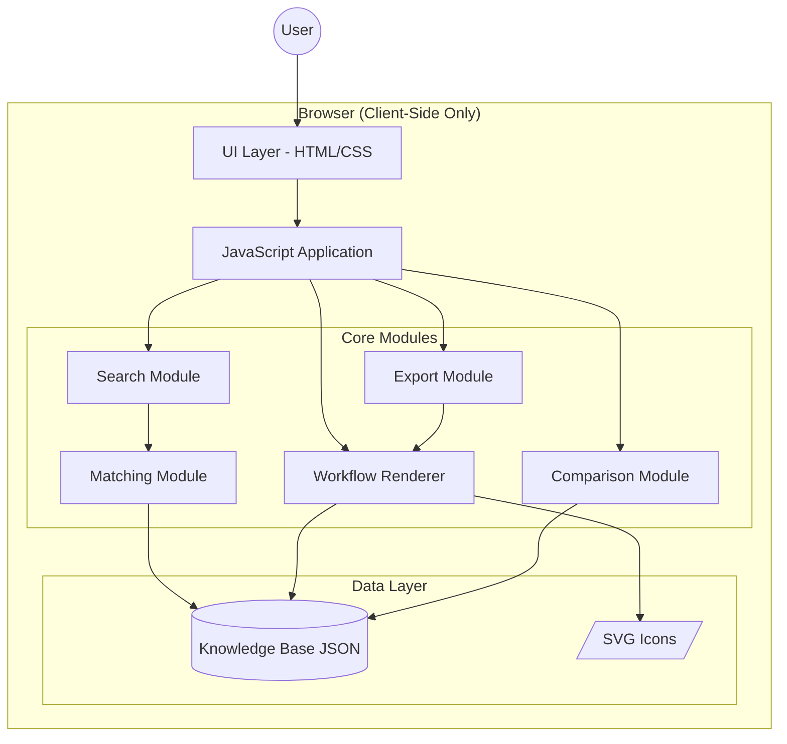

# Design Document: AWS Beginner Blueprint

## Overview

AWS Beginner Blueprint is a single-page educational web application that helps beginners choose AWS services for their projects. The application uses a static JSON knowledge base containing 200+ AWS services and 50+ solution patterns to provide intelligent recommendations, visual architecture diagrams, and cost guidance.

The system operates entirely on the client-side with no backend, database, or external API calls. All intelligence comes from keyword matching against the local knowledge base.

### Key Features
- Intent-based search using keyword matching
- Direct AWS service name search
- Trending topics browser (GenAI, Serverless, Containers, etc.)
- Visual workflow diagrams with AWS-style icons
- Stack comparison mode
- Export diagrams as PNG
- Cost guidance with badges
- Security notes and prerequisites
- Learning resources links

---

## Architecture



### Architecture Principles
1. **No Backend**: All logic runs in the browser
2. **Static Data**: Knowledge base is bundled JSON file
3. **Offline-First**: Works without network after initial load
4. **Single Page**: No routing, all sections on one page
5. **Progressive Enhancement**: Core functionality works without JavaScript animations

---

## Components and Interfaces

### 1. Application Entry Point (`app.js`)

```javascript
interface AppState {
  currentView: 'search' | 'service' | 'pattern' | 'comparison';
  selectedPattern: SolutionPattern | null;
  selectedService: AWSService | null;
  searchQuery: string;
  categoryFilter: string | null;
  comparisonMode: boolean;
}
```

### 2. Search Module (`search.js`)

Handles all search functionality including intent matching and service lookup.

```javascript
interface SearchModule {
  searchByIntent(query: string): MatchResult;
  searchByServiceName(query: string): AWSService[];
  filterByCategory(category: string): AWSService[];
  getPatternsByTopic(topicId: string): SolutionPattern[];
}

interface MatchResult {
  pattern: SolutionPattern | null;
  score: number;
  matchedKeywords: string[];
  noMatch: boolean;
}
```

### 3. Matching Module (`matching.js`)

Implements the keyword matching algorithm.

```javascript
interface MatchingModule {
  calculateScore(input: string, pattern: SolutionPattern): number;
  normalizeInput(input: string): string[];
  compareTagSpecificity(patternA: SolutionPattern, patternB: SolutionPattern): number;
  findBestMatch(input: string, patterns: SolutionPattern[]): MatchResult;
}
```

### 4. Workflow Renderer (`workflow-renderer.js`)

Renders visual architecture diagrams using SVG.

```javascript
interface WorkflowRenderer {
  render(diagram: WorkflowDiagram, container: HTMLElement): void;
  drawNode(node: WorkflowNode, x: number, y: number): SVGElement;
  drawArrow(from: WorkflowNode, to: WorkflowNode): SVGElement;
  getIconPath(serviceId: string): string;
}
```

### 5. Export Module (`export.js`)

Handles diagram export to PNG.

```javascript
interface ExportModule {
  exportToPNG(diagramElement: HTMLElement, patternId: string): void;
  generateFilename(patternId: string): string;
  addTitleToExport(canvas: HTMLCanvasElement, title: string): void;
}
```

### 6. Comparison Module (`comparison.js`)

Handles stack comparison functionality.

```javascript
interface ComparisonModule {
  getComparison(pattern: SolutionPattern): ComparisonData | null;
  generateComparisonTable(primary: StackInfo, alternative: StackInfo): HTMLElement;
}

interface ComparisonData {
  primary: StackInfo;
  alternative: StackInfo;
  dimensions: ComparisonDimension[];
}

interface StackInfo {
  label: string;
  services: string[];
  costLevel: string;
  scalingModel: string;
  managementOverhead: string;
  complexity: string;
}
```

### 7. UI Components

```javascript
// Intent Search Input Component
interface IntentSearchComponent {
  render(): HTMLElement;
  onSearch(callback: (query: string) => void): void;
  showNoMatchMessage(): void;
}

// Recommendation Panel Component
interface RecommendationPanelComponent {
  render(pattern: SolutionPattern): HTMLElement;
  showServiceCards(services: AWSService[]): void;
  showWorkflowDiagram(diagram: WorkflowDiagram): void;
  showCostGuidance(services: AWSService[]): void;
}

// Service Card Component
interface ServiceCardComponent {
  render(service: AWSService): HTMLElement;
  onClick(callback: (service: AWSService) => void): void;
}

// Documentation Panel Component
interface DocumentationPanelComponent {
  render(service: AWSService): HTMLElement;
  showRelatedServices(services: AWSService[]): void;
  toggle(): void;
}

// Trending Topics Component
interface TrendingTopicsComponent {
  render(topics: TrendingTopic[]): HTMLElement;
  onTopicSelect(callback: (topic: TrendingTopic) => void): void;
}

// Service Index Component
interface ServiceIndexComponent {
  render(services: AWSService[]): HTMLElement;
  filter(query: string, category: string | null): void;
  onServiceClick(callback: (service: AWSService) => void): void;
}

// Badge Components
interface BadgeComponent {
  renderPopularityBadge(score: number, tags: string[]): HTMLElement;
  renderCostBadge(costLevel: string): HTMLElement;
  renderDifficultyBadge(level: string): HTMLElement;
  renderFreeTierBadge(hasFreeTier: boolean): HTMLElement;
}
```

---

## Data Models

### AWSService

```javascript
interface AWSService {
  id: string;                      // e.g., "lambda", "s3", "dynamodb"
  name: string;                    // e.g., "AWS Lambda"
  icon: string;                    // e.g., "lambda.svg"
  category: Category;              // e.g., "Compute"
  tags: string[];                  // e.g., ["serverless", "functions"]
  intentKeywords: string[];        // e.g., ["function", "code", "serverless"]
  shortDescription: string;        // One-line description
  documentation: string;           // Short educational text
  billingModel: string;            // e.g., "Pay per request and compute time"
  costHint: string;                // e.g., "~$0.20 per 1M requests"
  hasFreeTier: boolean;
  relatedServiceIds: string[];     // Max 3 related services
  workflowTemplates: WorkflowTemplate[];
}

type Category = 
  | "Compute" | "Storage" | "Database" | "AI/ML" | "Analytics"
  | "Security" | "Networking" | "DevOps" | "Migration" | "IoT"
  | "Business Apps" | "Contact Center" | "Media Services" 
  | "Blockchain" | "Quantum";
```

### SolutionPattern

```javascript
interface SolutionPattern {
  id: string;                      // e.g., "serverless-api"
  label: string;                   // e.g., "Serverless API with Database"
  intentKeywords: string[];        // Keywords for matching
  stack: string[];                 // Service IDs in order
  summary: string;                 // Pattern description
  workflowDiagram: WorkflowDiagram;
  costSummary: string;             // Overall cost guidance
  costLevel: "Low" | "Medium" | "High";
  trendTags: string[];             // e.g., ["Serverless", "Event-Driven"]
  popularityScore: number;         // 1-100
  difficultyLevel: "Beginner" | "Intermediate" | "Advanced";
  estimatedBuildTime: string;      // e.g., "1-2 days"
  prerequisiteKnowledge: string[]; // e.g., ["REST APIs", "JSON"]
  securityNotes: string[];         // 1-3 security tips
  learningResources: LearningResource[];
  alternativeStack?: AlternativeStack;
}

interface AlternativeStack {
  label: string;
  services: string[];
  costLevel: string;
  scalingModel: string;
  managementOverhead: string;
  complexity: string;
}

interface LearningResource {
  title: string;
  url: string;
  type: "documentation" | "video" | "tutorial";
}
```

### WorkflowDiagram

```javascript
interface WorkflowDiagram {
  nodes: WorkflowNode[];
  edges: WorkflowEdge[];
}

interface WorkflowNode {
  id: string;
  serviceId: string;      // References AWSService.id or "user" for client
  label: string;
  position: number;       // Order in diagram (0 = leftmost)
}

interface WorkflowEdge {
  from: string;           // Node ID
  to: string;             // Node ID
  label?: string;         // Optional edge label
}
```

### TrendingTopic

```javascript
interface TrendingTopic {
  id: string;                    // e.g., "genai"
  label: string;                 // e.g., "Generative AI & ML"
  description: string;           // Short educational description
  relatedPatterns: string[];     // Pattern IDs
  icon: string;                  // Topic icon
}
```

### Knowledge Base Structure

```javascript
interface KnowledgeBase {
  services: AWSService[];
  patterns: SolutionPattern[];
  trendingTopics: TrendingTopic[];
  categories: Category[];
  version: string;
}
```

---

## Correctness Properties

*A property is a characteristic or behavior that should hold true across all valid executions of a system-essentially, a formal statement about what the system should do. Properties serve as the bridge between human-readable specifications and machine-verifiable correctness guarantees.*

### Property 1: Case-Insensitive Matching
*For any* user input string, the matching algorithm SHALL produce the same result regardless of the input's letter casing.
**Validates: Requirements 1.1, 2.1, 10.1**

### Property 2: Highest Score Selection
*For any* user input that matches multiple solution patterns, the selected pattern SHALL have a score greater than or equal to all other matching patterns.
**Validates: Requirements 1.2, 10.2**

### Property 3: Tiebreaker Consistency
*For any* set of patterns with equal match scores, the pattern with more specific tags (higher tag count) SHALL be selected.
**Validates: Requirements 1.3, 10.3**

### Property 4: Service Search Substring Match
*For any* partial service name search, all returned services SHALL contain the search term as a substring of their name or ID.
**Validates: Requirements 2.3**

### Property 5: Topic-Pattern Association
*For any* trending topic selection, all returned solution patterns SHALL have that topic's ID in their trendTags array.
**Validates: Requirements 3.2**

### Property 6: Stack Size Constraint
*For any* solution pattern in the knowledge base, the stack array SHALL contain between 1 and 5 service IDs.
**Validates: Requirements 4.2**

### Property 7: Workflow Node Order
*For any* workflow diagram, nodes SHALL be rendered in ascending order of their position field, with user/client nodes always at position 0.
**Validates: Requirements 5.1, 5.4**

### Property 8: Valid Edge References
*For any* workflow diagram, all edge from/to references SHALL correspond to valid node IDs within the same diagram.
**Validates: Requirements 5.2**

### Property 9: Service Data Completeness
*For any* AWS service in the knowledge base, the service SHALL have all required fields: id, name, icon, category, shortDescription, documentation, billingModel, costHint, and hasFreeTier.
**Validates: Requirements 6.1, 6.2, 6.3, 7.1, 7.4, 9.1**

### Property 10: Related Services Limit
*For any* service documentation display, the number of related services shown SHALL be at most 3.
**Validates: Requirements 7.2**

### Property 11: Category Filter Accuracy
*For any* category filter selection, all displayed services SHALL have a category field matching the selected category.
**Validates: Requirements 8.3**

### Property 12: Knowledge Base JSON Validity
*For any* knowledge base file, serializing to JSON and deserializing back SHALL produce an equivalent data structure.
**Validates: Requirements 9.5, 9.6**

### Property 13: Category Coverage
*For any* valid knowledge base, all 15 AWS categories SHALL have at least one service entry.
**Validates: Requirements 9.4**

### Property 14: Pattern Data Completeness
*For any* solution pattern in the knowledge base, the pattern SHALL have all required fields including prerequisiteKnowledge, estimatedBuildTime, difficultyLevel, securityNotes, and learningResources.
**Validates: Requirements 16.1, 16.2, 16.3, 16.4, 17.1, 17.4, 19.2**

### Property 15: Export Filename Format
*For any* diagram export, the generated filename SHALL match the pattern "{pattern-id}-architecture.png".
**Validates: Requirements 14.4**

### Property 16: Comparison Availability
*For any* solution pattern with an alternativeStack field defined, the comparison button SHALL be displayed.
**Validates: Requirements 15.1**

### Property 17: Popularity Badge Assignment
*For any* solution pattern, if popularityScore > 80 then "Trending" badge is shown; if score is 60-80 AND tags include "college" or "student" then "Popular for Projects" badge is shown.
**Validates: Requirements 18.2, 18.3**

### Property 18: Popularity Sort Order
*For any* list of solution patterns displayed in a grid, patterns SHALL be sorted by popularityScore in descending order.
**Validates: Requirements 18.4**

### Property 19: Security Notes Count
*For any* solution pattern, the securityNotes array SHALL contain between 1 and 3 items.
**Validates: Requirements 19.1**

### Property 20: Cost Badge Assignment
*For any* solution pattern, if costLevel is "Low" then "Low Cost Setup" badge is shown; if costLevel is "High" then "Cost Sensitive" badge is shown.
**Validates: Requirements 20.2, 20.3**

### Property 21: Popularity Score Range
*For any* solution pattern, the popularityScore SHALL be a number between 1 and 100 inclusive.
**Validates: Requirements 18.1**

### Property 22: Cost Level Validity
*For any* solution pattern, the costLevel SHALL be one of "Low", "Medium", or "High".
**Validates: Requirements 20.1**

---

## Error Handling

### Search Errors
- **No Match Found**: Display guidance message with example keywords
- **Empty Input**: Show placeholder text, do not trigger search
- **Invalid Characters**: Sanitize input, remove special characters

### Data Loading Errors
- **JSON Parse Error**: Display error message, suggest page refresh
- **Missing Icon**: Use placeholder icon, log warning
- **Invalid Service Reference**: Skip invalid reference, continue rendering

### Export Errors
- **Canvas Generation Failed**: Show error toast, suggest trying again
- **Download Blocked**: Provide alternative download instructions

### UI State Errors
- **Invalid State Transition**: Reset to default search view
- **Missing Required Data**: Show loading state or error message

---

## Testing Strategy

### Unit Testing
Use Jest for unit testing core logic modules:
- Matching algorithm score calculation
- Input normalization
- Category filtering
- Badge assignment logic
- Filename generation

### Property-Based Testing
Use fast-check library for property-based testing:
- Each correctness property (1-22) will have a corresponding property test
- Tests will generate random inputs to verify properties hold
- Minimum 100 iterations per property test
- Tests tagged with format: `**Feature: aws-beginner-blueprint, Property {N}: {description}**`

### Integration Testing
- Search flow: input → match → display
- Service click → documentation panel
- Topic selection → pattern display
- Export flow: diagram → PNG download

### Manual Testing Checklist
- Responsive design on mobile/tablet/desktop
- Keyboard navigation accessibility
- Screen reader compatibility
- Cross-browser testing (Chrome, Firefox, Safari, Edge)

---

## File Structure

```
aws-beginner-blueprint/
├── index.html
├── css/
│   ├── styles.css
│   ├── components.css
│   └── responsive.css
├── js/
│   ├── app.js
│   ├── search.js
│   ├── matching.js
│   ├── workflow-renderer.js
│   ├── export.js
│   ├── comparison.js
│   └── components/
│       ├── intent-search.js
│       ├── recommendation-panel.js
│       ├── service-card.js
│       ├── documentation-panel.js
│       ├── trending-topics.js
│       ├── service-index.js
│       └── badges.js
├── data/
│   └── knowledge-base.json
├── assets/
│   └── icons/
│       ├── lambda.svg
│       ├── s3.svg
│       ├── dynamodb.svg
│       └── ... (200+ service icons)
└── tests/
    ├── matching.test.js
    ├── search.test.js
    ├── properties.test.js
    └── integration.test.js
```